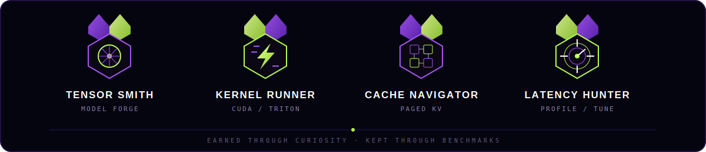

<!--
  ABDUL BASITH // ALIEN SYSTEMS PROFILE
  Quick setup: replace every YOUR_* token, then push this repo under your exact GitHub username.
  Full instructions live in CUSTOMIZE.md.
-->

<div align="center">


<br />



<br />

<a href="https://www.linkedin.com/in/abdul3asith/"></a>
<a href="https://x.com/basithtwts"></a>
<a href="https://huggingface.co/YOUR_HUGGINGFACE"></a>
<a href="https://YOUR_PORTFOLIO.dev"></a>
<a href="mailto:basithcodes@gmail.com"></a>

<br /><br />

`SYSTEMS ONLINE` &nbsp;•&nbsp; `SAN FRANCISCO, CA` 

</div>

---

### `01 // FLIGHT PROFILE`

```yaml
pilot: Abdul Basith
coordinates: "where neural networks meet silicon"
mission: "make intelligent systems faster, leaner, and easier to serve"
currently_building:
  - nano inference engines
  - CUDA and Triton kernels
  - paged KV caches and continuous schedulers
  - production LLM infrastructure
obsessions: [latency, throughput, memory bandwidth, clean systems]
```

I build at the boundary between **AI models and the hardware that runs them**—from transformer internals and PyTorch prototypes to CUDA kernels, paged attention, batching, and production inference systems.

My north star is simple: **less memory, fewer milliseconds, more useful intelligence per GPU.**

---

### `02 // OPERATING COORDINATES`

<table>
<tr>
<td width="50%" valign="top">

#### 🧠 Model Systems

`Transformers` · `LLMs` · `PyTorch` · `Autograd`  
`Attention` · `FlashAttention` · `MoE` · `RAG`  
`SFT / LoRA` · `Embeddings` · `Evaluation`

</td>
<td width="50%" valign="top">

#### ⚡ GPU Performance

`CUDA C++` · `Triton` · `CuTe / CUTLASS`  
`Kernel Fusion` · `Coalescing` · `Tiling` · `Occupancy`  
`Warp Divergence` · `Nsight Systems / Compute` · `Roofline`

</td>
</tr>
<tr>
<td width="50%" valign="top">

#### 🛰️ LLM Inference

`SGLang` · `vLLM` · `TGI` · `Paged KV Cache`  
`Continuous Batching` · `Prefix / Radix Caching`  
`Quantization` · `Speculative Decoding` · `Parallelism`

</td>
<td width="50%" valign="top">

#### 🛠️ Systems & Platform

`Python` · `C / C++` · `Go` · `Rust` · `Linux`  
`Docker` · `Kubernetes` · `Postgres` · `Redis`  
`FastAPI` · `AWS` · `Modal` · `Observability`

</td>
</tr>
</table>

<details>
<summary><b>Expand the full engineering arsenal</b></summary>
<br />

**Languages**


**AI, kernels & inference**


**Infrastructure**


**Deepening the orbit**

`TensorRT-LLM` · `NCCL` · `CUDA Graphs` · `torch.compile` · `FP8 / BF16 / INT8` · `Distributed Inference`

</details>

---

### `03 // ACTIVE MISSIONS`

| Mission | What lives inside | Signal |
|:--|:--|:--:|
| [**Nano SGLang**](https://github.com/abdul3asith/nano-sglang) | A from-scratch inference engine: scheduler, paged KV cache, request lifecycle, and measured concurrent decoding. | `INFERENCE` |
| [**GPU Kernel Lab**](https://github.com/abdul3asith/cuda-kernel-lab) | CUDA GEMM, fused softmax, Triton kernels, FlashAttention experiments, and profiling notes. | `KERNELS` |
| [**Mini-GPT 125M**](https://github.com/abdul3asith/mini-gpt) | A decoder-only transformer built in PyTorch with attention, positional encoding, training, and ablations. | `MODELS` |
| [**Inference Gateway**](https://github.com/abdul3asith/inference-gateway) | Streaming, routing, identity, health checks, and fallback across local and hosted LLM backends. | `SYSTEMS` |

> These are the four repos I would pin first for an AI infrastructure / GPU performance recruiter.

---

### `04 // PERFORMANCE TELEMETRY`

<div align="center">


<br />


<br />


</div>

---

### `05 // MISSION INSIGNIA`

<div align="center">

</div>

---

### `06 // THE CONTRIBUTION SERPENT`

<div align="center">

<picture>
  <source media="(prefers-color-scheme: dark)" srcset="https://raw.githubusercontent.com/abdul3asith/abdul3asith/output/alien-contribution-serpent-dark.svg" />
  <source media="(prefers-color-scheme: light)" srcset="https://raw.githubusercontent.com/abdul3asith/abdul3asith/output/alien-contribution-serpent.svg" />
  
</picture>

<sub>The serpent is generated daily from the real contribution grid by the included GitHub Action.</sub>

</div>

---

<div align="center">

### `INCOMING TRANSMISSIONS WELCOME`

I’m interested in hard problems across **LLM inference, GPU kernels, distributed systems, and performance engineering**.

<a href="mailto:basithcodes@gmail.com"></a>

<br /><br />


<sub>Built beyond Earth. Optimized for silicon.</sub>

</div>
